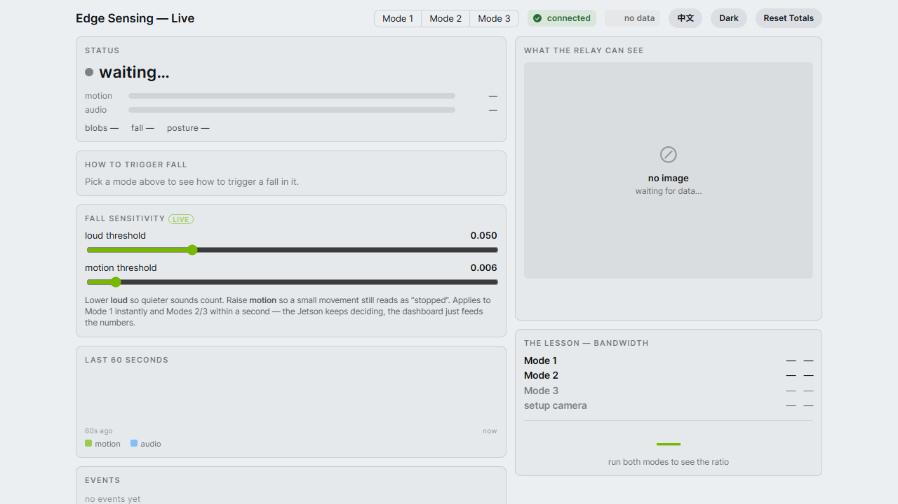
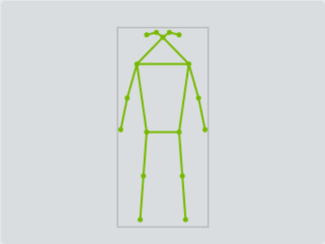
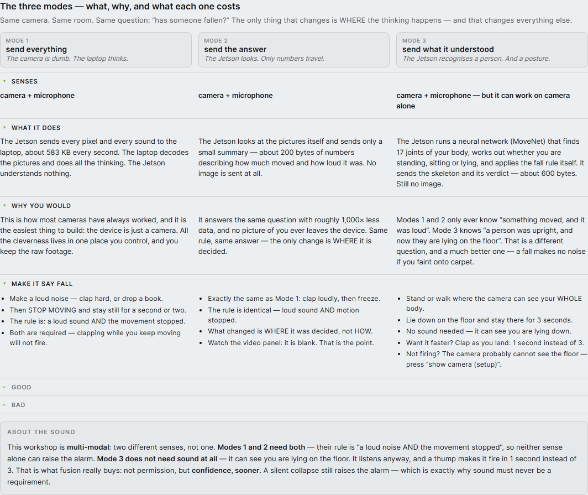

# Multi-Modal Posture Recognition on the Edge — Jetson Nano

A hands-on workshop that answers one question:

> **Between a camera and the cloud, where should the thinking happen?**

The application is **fall detection for elderly care**. A camera and a microphone watch a
room. Something has to decide "has this person fallen?" — and you can put that decision in
three different places. This project runs all three, **live, on the same hardware, over the
same cable**, and shows you what each one costs.

```
[ Jetson Nano ]  ── LAN cable ──▶  [ Your laptop ]
  the edge                           the "cloud"
  USB camera + mic                   relay + web dashboard
  runs Mode 1 / 2 / 3                holds any API key
```

The Jetson senses. The laptop displays. **What crosses that cable is the entire lesson** —
and you choose it, live, with three buttons on the dashboard.

Everything is watchable in a browser at `http://127.0.0.1:8000`: the live video (or its
pointed absence), a skeleton, the bandwidth each mode costs, and a fall alarm.



*This is what you get after Step 3 — before the Jetson has sent anything. `connected`
means the browser reached the relay; `waiting…` means the Jetson is not sending yet.
**A blank dashboard at this point is correct, not broken.***

---

## The one picture that is the whole workshop

Same camera, same room, same second. **This is what the laptop received**, in each mode:

| Mode 1 — send everything | Mode 2 — send the answer | Mode 3 — send what it understood |
|---|---|---|
|  |  |  |
| **~583 KB every second.** The relay has the picture, because every pixel was sent to it. *In a real room, this is your face.* | **~200 B.** The panel is empty because **the relay has no image** — none was ever sent. It still knows whether someone moved. | **~611 B.** A skeleton drawn from 17 coordinates, over **nothing**. The Jetson understood the person completely; the laptop never saw them. |

**Mode 2's empty panel is not a bug. It is the entire point** — and the fact that Mode 3
can draw a moving human figure over that same emptiness is the punchline.

> **About these screenshots:** they were captured with the **synthetic test scene** (the
> default when no webcam is attached), which is why Mode 1 shows a grey field with a pale
> square rather than a room. That square *is* the "person" the synthetic sensor moves
> around. With a real camera on the Jetson, Mode 1's panel shows the actual room and the
> actual faces in it — which is exactly why we did not put one in a public repository.

---

## The three modes

Same camera. Same room. Same question. The only thing that changes is **where the thinking
happens** — and that changes everything else.

| | **Mode 1** — send everything | **Mode 2** — send the answer | **Mode 3** — send what it understood |
|---|---|---|---|
| **In one line** | The camera is dumb. The laptop thinks. | The Jetson looks. Only numbers travel. | The Jetson recognises a person. And a posture. |
| **Senses** | camera + microphone | camera + microphone | camera + microphone — but it works on camera alone |
| **What crosses the cable** | every pixel + every sound | ~200 bytes of numbers | a skeleton + a verdict |
| **Per second** | **~583 KB** | **~200 B** | **~611 B** |
| **What it does** | The Jetson sends every pixel and every sound to the laptop. The laptop decodes the pictures and does all the thinking. The Jetson understands nothing. | The Jetson looks at the pictures itself and sends only a small summary — how much moved, how loud it was. No image is sent at all. | The Jetson runs a neural network (MoveNet) that finds 17 joints of your body, works out whether you are standing, sitting or lying, and applies the fall rule itself. Still no image. |
| **Why you would** | It is how most cameras have always worked, and the easiest thing to build: the device is just a camera. All the cleverness lives in one place you control, and you keep the raw footage. | Same question, same answer, ~1,000× less data — and no picture of you ever leaves the device. The only change is *where* it is decided. | Modes 1 and 2 only ever know "something moved, and it was loud". Mode 3 knows "a person was upright, and now they are lying on the floor". A fall makes no noise if you faint onto carpet. |
| **Make it say FALL** | Clap hard (or drop a book), **then stop moving**. The rule is: a loud sound **AND** the movement stopped. Both are required — clapping while you keep moving will not fire. | Exactly the same: clap, then freeze. The rule is identical. What changed is *where* it was decided. Watch the video panel: it is blank. That is the point. | Stand or walk where the camera sees your **whole body**, then **lie down and stay there 3 seconds**. No sound needed. Want it faster? **Clap as you land** — 1 second instead of 3. |
| **Good** | ✓ Simplest possible device — no AI on the edge<br>✓ Change the algorithm any time; nothing to redeploy<br>✓ You keep the raw video for later analysis<br>✓ The laptop can double-check anything it saw | ✓ ~1,000× less data<br>✓ No pixel of you ever leaves the device<br>✓ Survives a network drop — it buffers and catches up<br>✓ Scales: 100 cameras is still a trickle | ✓ Understands posture, not just "something moved"<br>✓ Catches a **silent** fall — a faint makes no thump<br>✓ Still tiny, and the skeleton is visible proof the AI ran on the device<br>✓ A thump makes it fire in 1s instead of 3s |
| **Bad** | ✗ One camera saturates a cheap network<br>✗ Your face leaves the room and travels the LAN<br>✗ Network drops = those seconds are gone forever<br>✗ 100 cameras = 100× the bandwidth. It does not scale | ✗ The laptop cannot double-check — it never saw an image<br>✗ A crude rule: a TV or a pet can fool it<br>✗ Changing the algorithm means redeploying to the device<br>✗ It knows something moved. Not that it was a person | ✗ Needs a real model on the device, and more CPU<br>✗ A 2D camera cannot see a fall straight toward the lens<br>✗ Camera placement matters more than anything else<br>✗ A rule on top of AI joints, not a trained fall model |

**~583 KB versus ~600 B, for the same answer.** Three orders of magnitude. That gap is the
whole workshop, and the dashboard counts it live while you watch.

### About the sound — this is a *multi-modal* workshop

Two different senses, not one. It is worth being precise about how they combine, because
the three modes do it differently and the difference is the lesson:

- **Modes 1 and 2 need both.** Their rule is *"a loud noise **AND** the movement stopped"*.
  Neither sense alone can raise the alarm.
- **Mode 3 does not need sound at all.** It can *see* you are lying on the floor. It listens
  anyway, and a thump makes it fire in **1 second instead of 3**.

That is what fusion really buys: **not permission, but confidence, sooner.** A silent
collapse still raises the alarm — which is exactly why sound must never be a *requirement*.
Gating on sound would look tidier and would quietly stop detecting the person who faints.

### …and all of the above is already on the dashboard

**Instructors: you do not need slides for this.** Everything in this section is on the page
itself, at the bottom, in both English and 繁體中文 (there is an **EN / 中文** button in the
header). Each topic is a row you click open, so the three modes always line up side by side:



The **How to trigger FALL** steps also appear *in the live panel*, following whichever mode
is selected — so a student experimenting on their own always has the instructions next to
the thing they are trying to change.

---

## Setting it up

> **Read this once before you start.** Two machines are involved and they must agree.
> Everything on the **laptop** is done first, because the Jetson needs the laptop's address.
>
> **The install steps need internet.** Do them while you still have Wi-Fi — the workshop LAN
> is a bare cable between two machines with no route to the outside world.

### What you need

| | |
|---|---|
| A laptop | Windows, macOS or Linux. This runs the relay + dashboard. |
| A Jetson Nano | Flashed with the workshop SD image. This is the edge device. |
| A USB webcam | A Logitech C270 — it is the **camera and the microphone**, one device. |
| A LAN cable | Laptop ↔ Jetson, direct. |

---

## Part 1 — the laptop

### Step 1. Install `git` and `uv` (needs internet)

`uv` runs Python for you: it reads `pyproject.toml`, builds the environment, and runs the
command — no virtualenv to create, activate or forget.

```powershell
# Windows
winget install Git.Git
winget install astral-sh.uv
```

```bash
# macOS / Linux
brew install git                                    # or your package manager
curl -LsSf https://astral.sh/uv/install.sh | sh
```

**Check it worked** — both must print a version:

```bash
git --version
uv --version
```

> **If `uv` will not install** (locked-down machine, corporate policy), use the fallback at
> the end of Part 1. Do not fight it — you are here to learn edge computing, not package
> managers.

### Step 2. Get the code

```bash
git clone https://github.com/jeffrymahbuubi/edge_workshop_camera.git
cd edge_workshop_camera
```

**Check it worked** — the AI model must be there (4.7 MB; it ships in the repo, you do not
download it separately):

```bash
ls -l src/models/movenet_lightning.tflite
```

### Step 3. Start the relay

From the repo root:

```bash
uv run uvicorn relay.relay_server:app --app-dir src --host 0.0.0.0 --port 8000
```

The first run takes a minute while `uv` downloads the dependencies. After that it is
instant. **Leave this window open** — this is the server. `Ctrl+C` stops it.

> ⚠️ **`--host 0.0.0.0`, not `127.0.0.1`.** This is the single most common setup mistake.
> `127.0.0.1` means "only this machine can connect", and the Jetson is *not* this machine —
> it would be refused with no useful error. `0.0.0.0` means "anyone on the cable".

**Check it worked** — in a *second* terminal:

```bash
curl http://127.0.0.1:8000/health
# {"ok":true}
```

### Step 4. Open the dashboard

Go to **<http://127.0.0.1:8000>** in a browser.

**Check it worked:** you see the dashboard, the badge top-right says **connected**, and the
status reads **waiting…**. It says `waiting…` because the Jetson is not sending anything
yet — that is correct, not broken. It should look
[exactly like this](docs/images/dashboard-first-load.png).

### Step 5. Let the Jetson through your firewall

The Jetson has to reach *in* to your laptop. A laptop firewall blocks that by default, and
the failure is silent from the Jetson's side.

```powershell
# Windows — run PowerShell AS ADMINISTRATOR, once
New-NetFirewallRule -DisplayName "Edge workshop relay" -Direction Inbound `
  -LocalPort 8000 -Protocol TCP -Action Allow
```

macOS/Linux: allow incoming connections on port 8000 if prompted.

### Step 6. Find your laptop's address on the cable

The Jetson needs this. It is **not** `127.0.0.1`.

```powershell
ipconfig          # Windows — look for the Ethernet adapter, e.g. 192.168.137.1
```

```bash
ip addr           # Linux
ifconfig          # macOS
```

Write it down. Below it is written as `<LAPTOP_IP>`.

### Fallback: if `uv` will not install

`pyproject.toml` is the source of truth; `requirements.txt` mirrors it for pip.

```bash
python -m venv .venv
.venv\Scripts\activate            # Windows
source .venv/bin/activate         # macOS / Linux
pip install -r requirements.txt
python -m uvicorn relay.relay_server:app --app-dir src --host 0.0.0.0 --port 8000
```

---

## Part 2 — the Jetson

> ⚠️ **NEVER `pip install` anything on the Jetson.** OpenCV, NumPy and TensorFlow come from
> JetPack's system packages and are **already there**. `pip install opencv-python` on a Nano
> tries to compile OpenCV from source on a 4-core ARM board — it will appear to hang for
> hours and then fail. The SD image has everything. `pyproject.toml` and `requirements.txt`
> are for the **laptop only**.

### Step 7. Plug in the camera

The C270 is your **camera and your microphone**. One USB port, both senses.

**Check it worked:**

```bash
ls /dev/video0                    # must exist
```

### Step 8. Get the code onto the Jetson

```bash
git clone https://github.com/jeffrymahbuubi/edge_workshop_camera.git
cd edge_workshop_camera/src
```

Everything below runs from **`edge_workshop_camera/src`**.

> ⚠️ **Always run the code as a module** — `python3 -m edge.supervisor`, never
> `python3 edge/supervisor.py`. The bare script form fails with
> `ModuleNotFoundError: No module named 'common'`, because Python only finds the sibling
> packages when you launch from `src/` with `-m`.

### Step 9. Check the microphone — do not skip this

**A dead microphone looks exactly like a healthy one.** No error, no warning; `audio` simply
reads `0.0` forever and Modes 1 and 2 can never raise a fall. This is the single most
expensive failure in this project, so prove it before you perform for the camera:

```bash
pactl info | grep 'Default Source'
```

**It must name the C270**, something like:

```
Default Source: alsa_input.usb-046d_C270_HD_WEBCAM_...-02.analog-mono
```

If it says `alsa_input.platform-sound.analog-stereo` instead, PulseAudio is listening to the
Nano's **onboard jack — which has nothing plugged into it**. Fix in Troubleshooting below.

> Beware: `lsusb`, `arecord -l` and `/proc/asound/cards` will all cheerfully show the C270
> working even when your program is deaf. Only `pactl info` tells the truth.

### Step 10. Start the supervisor

The supervisor is the Jetson's only long-running program. It watches the dashboard's mode
buttons and starts/stops the right client for you.

```bash
RELAY_URL=http://<LAPTOP_IP>:8000 SENSOR=webcam python3 -u -m edge.supervisor
```

> ⚠️ **Both environment variables are required**, and the failure mode of forgetting them is
> confusing:
> - **No `RELAY_URL`** → it polls its *own* localhost, where nothing is listening, and prints
>   `Connection refused` forever. It is talking to itself.
> - **No `SENSOR=webcam`** → it runs on a synthetic test scene and ignores your camera
>   completely. Everything looks like it works. Nothing you do in front of the lens matters.

**Check it worked** — it should print, and then wait quietly:

```
[supervisor] polling http://<LAPTOP_IP>:8000/mode every 2s  (Ctrl-C to stop)
```

If instead it prints `relay unreachable`, prove the link before changing anything:

```bash
wget -qO- http://<LAPTOP_IP>:8000/health
# {"ok":true}
```

No answer here means the **laptop's firewall** (Step 5), the wrong IP (Step 6), or the relay
bound to `127.0.0.1` (Step 3). It is almost never the Jetson.

### Step 11. Drive it from the dashboard

Click **Mode 1 / Mode 2 / Mode 3** in the browser. The supervisor swaps clients within about
two seconds. You never touch the Jetson again.

**Check it worked** — watch the video panel tell the story (this is
[the trio at the top of this README](#the-one-picture-that-is-the-whole-workshop), now with
your real room in it):

| Click | The panel shows | Because |
|---|---|---|
| **Mode 1** | your face | every pixel crossed the cable |
| **Mode 2** | **nothing** | the relay has no image — none was sent |
| **Mode 3** | a **skeleton** on an empty background | only 17 coordinates crossed |

Mode 2's blank panel is **not a bug**. It is the privacy lesson, made watchable.

---

## Camera placement — read this before you blame the code

**This matters more than anything else in the project.** It is a placement problem, not a
software problem, and bad framing has ruined more test runs here than every bug combined.

```
        ✓ RIGHT                              ✗ WRONG

   camera a few metres back            camera on the desk, close
   SIDE-ON to the fall                 pointing at your face
   whole body in frame                 head and shoulders only
   floor visible                       no floor in shot

     [cam]                               [cam]
       |                                   |
       |    o                              |   (o)
       |   /|\    ← whole body             |    ¯    ← where are the legs?
       |   / \                             |
       └───────────  ← floor in shot       └── (no floor at all)
```

- **A few metres back**, whole body in frame — **knees included**. Sitting and standing are
  told apart by where the knees are.
- **SIDE-ON to where the fall happens.** A fall straight toward or away from the lens is
  foreshortened — head and hips project on top of each other, and **no 2D method can read
  it**. This is geometry, not a bug.
- **The floor must be in shot.** If the camera cannot see the floor, it cannot see you lying
  on it, and Mode 3 will never fire no matter how convincingly you fall.
- **Check the frame before you trust anything.** In Mode 3, press **"show camera (setup)"**
  on the dashboard — it turns the camera on temporarily so you can see what it sees.
  Watch the bandwidth number jump about 1,000×, frame yourself, then **turn it off** and
  watch it collapse back. That jump is the whole lesson in one button.

### Safety

**You do not need to actually fall.** A controlled lie-down is enough — the rule only cares
that `lying` persists for 3 seconds, not how you got there. Use a mat. Do not drop.

---

## Troubleshooting — the three failures that look like bugs

Each of these looks like broken code. None of them are.

### "Audio always reads 0.0 and a fall never fires in Mode 1 or 2"

Your microphone is deaf, silently. PulseAudio defaults to the Nano's **onboard jack**, which
has nothing plugged into it — so your program records digital silence while `lsusb` and
`arecord` insist the webcam is fine.

Prove it, then fix it permanently (a runtime `pactl set-default-source` does **not** survive
a reboot):

```bash
pactl info | grep 'Default Source'          # naming the onboard jack = deaf
pactl list short sources | grep -i c270     # find the C270's real name

# make it permanent
mkdir -p ~/.config/pulse
echo '.include /etc/pulse/default.pa'                >  ~/.config/pulse/default.pa
echo 'set-default-source <THE_C270_NAME_FROM_ABOVE>' >> ~/.config/pulse/default.pa
pulseaudio -k                                # restart the daemon
pactl info | grep 'Default Source'           # must now name the C270
```

**Check it worked:** in Mode 1 or 2, the dashboard's `audio` bar should read roughly
**0.01–0.03** in a quiet room — not `0.0000`. Clap: it should jump past 0.05.

### "Everything reads `absent` / the camera seems dead"

A leftover process from your last run is still holding the camera. Two programs cannot open
one webcam, so the second gets empty frames and reports an empty room.

```bash
pkill -9 -f '[e]dge\.'      # the [e] is not a typo -- see below
sleep 2
pgrep -af '[e]dge\.' || echo CLEAN
```

> The bracket trick matters: plain `pkill -f 'edge\.'` **matches its own command line** and
> kills the shell running it — you get exit code 128 and no output, and the real process
> survives.

Then wait ~2 seconds before restarting: the camera needs a moment to be released.

### "Mode 3 never says FALL, no matter how I lie down"

Almost always **framing**, not the detector. Go back to *Camera placement* above. The single
most common cause: **the floor is not in the frame**, so the camera literally cannot see you
lying on it. Press **"show camera (setup)"** and look.

If the framing is genuinely right and it still will not fire, lower the fall hold on the
Jetson: `FALL_HOLD_S=2 RELAY_URL=... SENSOR=webcam python3 -u -m edge.supervisor`.

---

## Running the tests

```bash
uv run --extra dev python -m pytest tests/ -q       # 103 tests
```

---

## Repo layout

| Path | What's in it |
|---|---|
| `src/relay/` | The relay + web dashboard. **Laptop.** |
| `src/edge/` | The three mode clients, the supervisor, the fall rule, the pose model wrapper. **Jetson.** |
| `src/common/` | Shared config, wire codec, and the model-free feature extraction both sides use. |
| `src/web/` | The dashboard: `index.html`, `app.js` (live instrument), `content.js` (all copy, both languages), `compare.js` (the teaching section). |
| `src/models/` | `movenet_lightning.tflite` — 4.7 MB, committed, no download needed. |
| `tests/` | 103 tests. Run them on the laptop. |
| [`docs/specs/`](docs/specs/) | **The build guide.** SPEC-01 is the contract — if any spec disagrees with it, SPEC-01 wins. |
| [`docs/`](docs/README.md) | Design decisions, hardware runbooks, and the reasoning behind the wrong turns. |

---

## Status

- ✅ Modes 1, 2 and 3 built and hardware-validated on a real Jetson Nano + C270
- ✅ Mode switching, live threshold tuning, and the bandwidth counter — all from the dashboard
- ✅ The fall alarm fires on a real person (Mode 3, MoveNet keypoints)
- 🟡 **Mode 3 audio fusion + the setup preview** — built and unit-tested (SPEC-08), **not yet
  hardware-validated**
- ⬜ The escalation VLM path — deferred; blocked on an API provider decision

Open questions are recorded in the specs, next to the decisions they affect. When one is
answered on the device, record the answer back into the spec.
